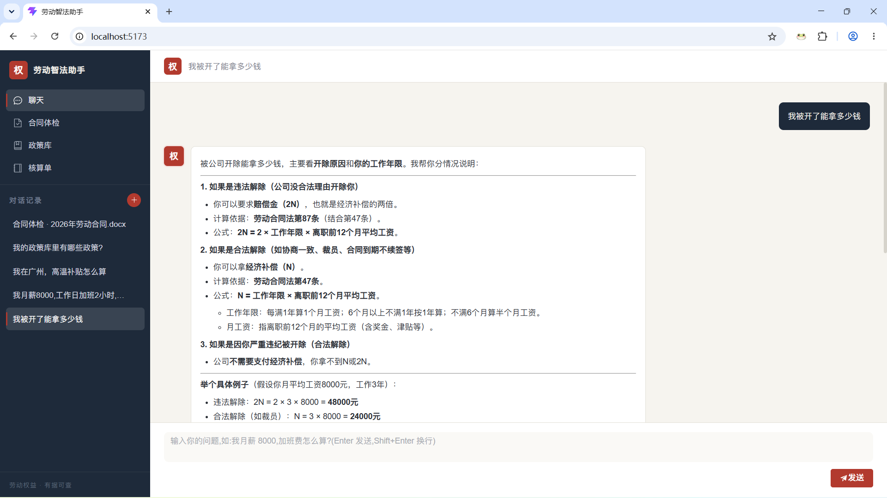
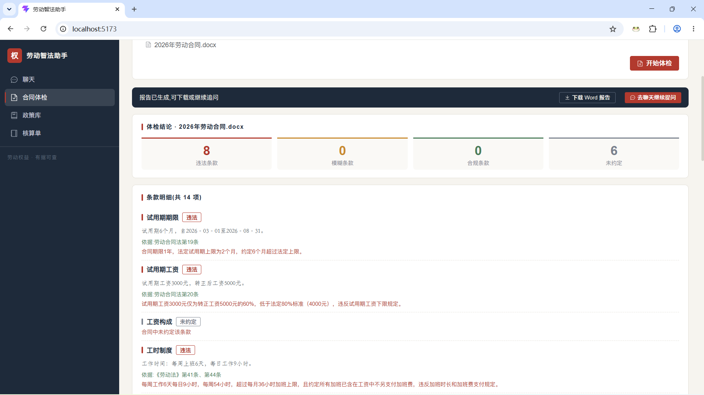
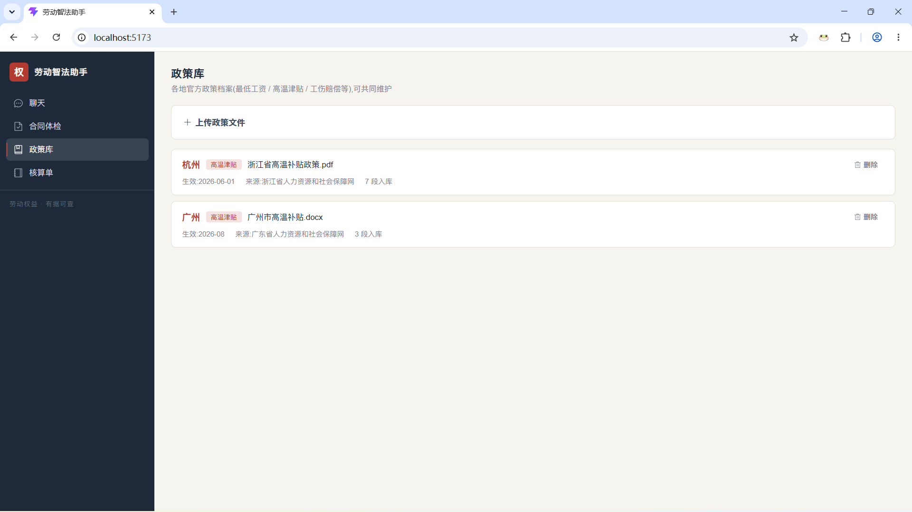
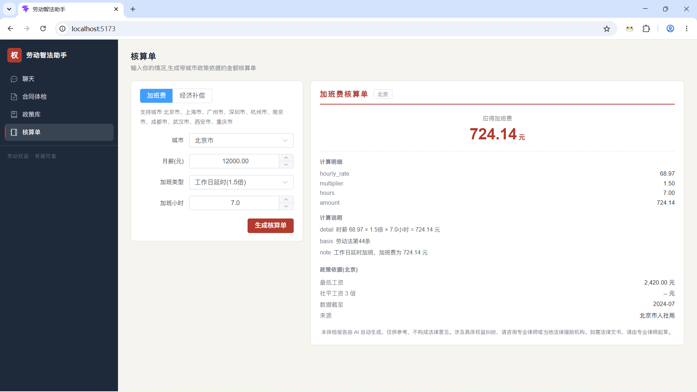

# 劳动智法助手（Labor Rights Agent）

一个面向劳动者的 **AI 劳动权益 Agent**：多轮问答、金额核算、合同体检、本地政策检索，全部带法条引用与免责声明。

用户用口语提问（"我被裁员了能拿多少？""国庆加班工资怎么算？"），系统通过**多轮记忆 + RAG 法条检索 + 计算工具调用 + 合同体检**给出**可验证的答案和数字**。

## 一、功能展示

**1. 聊天** —— SSE 流式打字机回答,工具调用徽标(「核算凭证」),法条来源逐条展开可核验


**2. 合同体检** —— 上传或粘贴劳动合同 → 风险分级报告(违法/模糊/合规统计 + 逐条检查 + 处置建议),可下载 Word 版报告,并可跳转聊天继续追问


**3. 政策库** —— 各地官方政策档案(最低工资/高温津贴/工伤赔偿等),支持上传维护


**4. 核算单** —— 输入情况生成带城市政策依据的金额核算单(最低工资/社平3倍封顶线)


## 二、技术栈

| 端 | 技术 |
| --- | --- |
| 后端 | Python 3.13 · FastAPI · LangGraph · ChromaDB(fastembed BGE 中文向量,混合检索 + BGE-M3 重排) · DeepSeek API · SQLite(SQLModel) |
| 前端 | Vue 3 · Vite · Element Plus · Axios · SSE 流式(fetch + ReadableStream) |

## 三、核心能力

| 能力 | 实现 |
|---|---|
| 多轮对话记忆 | SQLite 持久化会话 + 历史截断（最近 10 轮） |
| RAG 法条检索 | Chroma 向量库 + BGE 本地 embedding（条文级入库）+ **query 改写**（口语→法言法语，命中率 88%→100%）|
| 计算工具调用 | 加班费 / 经济补偿(N·N+1·2N·封顶) / 个税 / 年假，**pytest 26 项通过，计算 100% 准确** |
| Agent 编排 | 手写 ReAct（原理版）+ **LangGraph**（正式版：状态图 + 条件路由 + 防死循环）|
| SSE 流式输出 | 打字机效果 + 工具调用事件（tool/delta/done） |
| **合同体检** | 上传劳动合同（md/txt/pdf/docx）→ 条款抽取 → 合规比对 → **风险分级报告**（🔴🟡🟢⚪）+ 维权路径 + 证据清单 |
| **动态政策库** | 用户上传当地官方政策文件 → 众包共享；按城市检索（"我在杭州"→杭州政策）|
| **核算单** | 输入员工信息 + 城市 → 输出确定性核算单（经济补偿按当地社平封顶，数据可溯源）|
| **混合检索** | 手写 BM25 + 向量 → RRF 融合，**Recall@1 从 50% 提升至 66.7%**（对比实验验证）|
| 安全边界 | 不生成法律文书、复杂案情建议线下咨询、来源可追溯、免责声明贯穿 |


## 四、目录结构

```
├── backend/                # 后端服务(项目根,直接在此启动)
│   ├── .env                # 密钥配置(已 gitignore,需自行创建)
│   ├── .venv/              # Python 虚拟环境(uv 创建)
│   ├── main.py             # FastAPI 入口(端口 8000)
│   ├── app/
│   │   ├── agent/          # Agent 循环(LangGraph / 流式)
│   │   ├── api/            # 聊天 / 会话 / 合同体检 / 政策库 / 核算单接口
│   │   ├── core/           # LLM 调用、RAG 检索(混合+重排)、记忆、工具、合同解析检查
│   │   ├── schemas/        # Pydantic/SQLModel 模型
│   │   └── utils/          # 配置加载、提示词加载
│   ├── scripts/            # 知识库入库 / 评估 / 检索评估脚本
│   └── data/               # SQLite 库、法条/规则/政策文档、向量库、embedding 缓存
├── frontend/               # 前端应用(Vue 3 + Element Plus,四功能台)
│   └── src/
│       ├── api/            # 会话/合同/政策/核算接口 + SSE 流式解析
│       ├── composables/    # useChat 聊天状态机
│       ├── components/     # 会话栏 / 消息列表 / 输入框
│       └── views/          # 合同体检 / 政策库 / 核算单视图
└── images/                 # README 截图
```


## 五、快速开始

### 1. 后端(端口 8000)

```bash
# 首次:创建 .env 并填入 DeepSeek API Key(参考 backend/.env.example)
#   DEEPSEEK_API_KEY=sk-xxx
#   DEEPSEEK_BASE_URL=https://api.deepseek.com
#   DEEPSEEK_MODEL=deepseek-chat
cd backend
uv sync                       # 安装依赖(首次)
copy .env.example .env        # 填 DEEPSEEK_API_KEY
uv run python scripts/ingest_kb.py --force   # 法条+合规规则入库(首次下载 BGE 模型 ~100MB)
uv run uvicorn main:app --reload        # 启动 http://127.0.0.1:8000
```

> 首次提问会自动下载 embedding 模型到 `backend/data/embedding_cache/`(D 盘,约 100MB),并构建 Chroma 向量库,请耐心等待。

### 2. 前端(端口 5173)

```bash
cd frontend
npm install
npm run dev
```

浏览器打开 http://localhost:5173 。开发环境由 Vite 把 `/api` 代理到 `http://127.0.0.1:8000`,前后端同源,无需处理 CORS。

### 3.使用示例

- 对话："我工作 11 年，月薪 40000，在广州被裁员，补偿多少？" → 核算单（广州社平封顶 33786×11=371646）
- 政策库：上传/data/广州市高温补贴.docx→ 所有用户可检索
- 对话："我在杭州，高温津贴怎么发？" → 检索用户上传的杭州政策文件并带引用回答
- 合同体检：上传/data/广州市高温补贴.docx合同文本 → 🔴 违法条款 + 维权路径 + 证据清单，可下载 Word 报告


### 4. 评估

```bash
cd backend
uv run python scripts/run_eval.py --only-local   # 计算题(离线)
uv run python scripts/run_eval.py                 # 全部(需服务运行)
uv run python scripts/run_eval.py --category 体检 # 合同体检测试集（需服务） "计算", "法条", "多轮", "体检"
uv run python scripts/eval_retrieval.py --top-k 5     # 检索质量对比（基线 vs 混合 vs 精排）
```

> 存放在 backend/data/eval_report.md 与 backend/data/retrieval_eval_report.md


### 5.检索对比实验结果（12 条法条题）

| 策略                      | Recall@1   | Recall@5 | MRR       |
| ------------------------- | ---------- | -------- | --------- |
| 基线（纯向量）            | 50.00%     | 83.33%   | 0.653     |
| **混合（BM25+向量+RRF）** | **66.67%** | 91.67%   | **0.778** |

> rerank（bge-reranker-v2-m3）实测未提升（语料小、top-5 已命中），诚实记录于 README，未接入聊天接口。


## 六、已支持的计算工具

- 加班费(工作日 1.5 倍 / 休息日 2 倍 / 法定节假日 3 倍)
- 个税(累计预扣法)
- 经济补偿金(N / N+1 / 2N,含社平 3 倍封顶)
- 年休假天数(满 1 年 5 天 / 满 10 年 10 天 / 满 20 年 15 天)
- 城市政策查询(最低工资、社平工资 3 倍封顶线)
- 政策库清单(列出已入库的城市政策)
- 核算单生成(经济补偿 / 加班费,带政策依据)

# 免责声明

本项目回答仅供参考,不构成法律意见;涉及具体权益纠纷请咨询专业律师。
